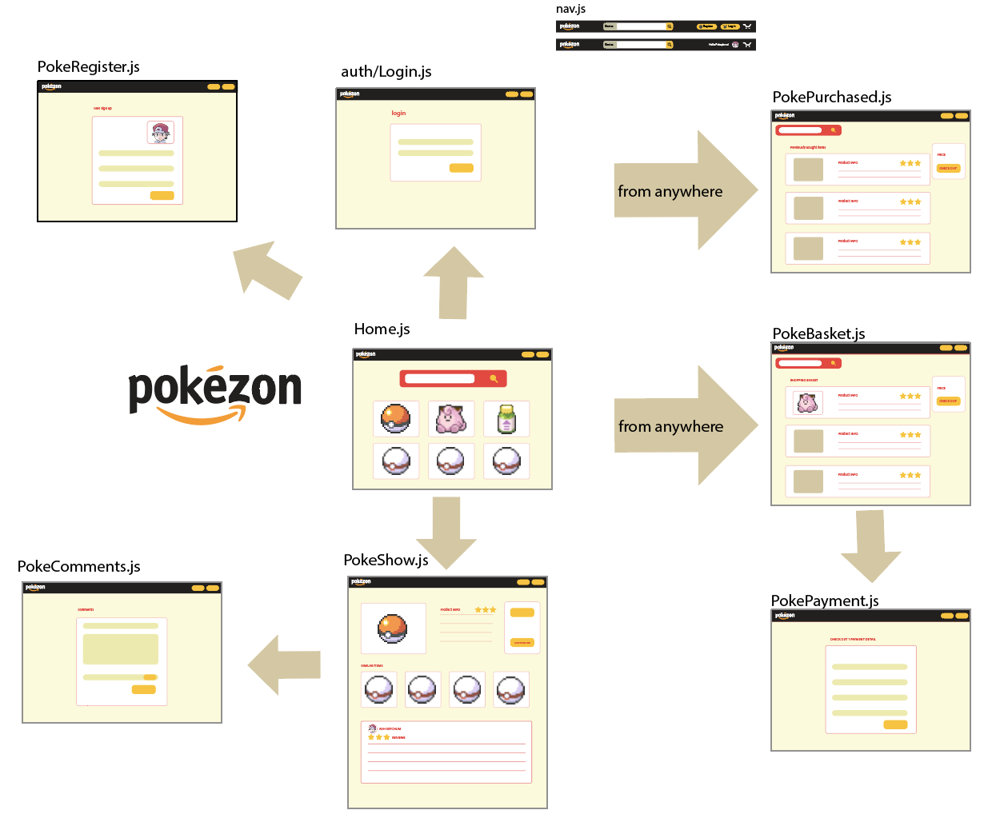
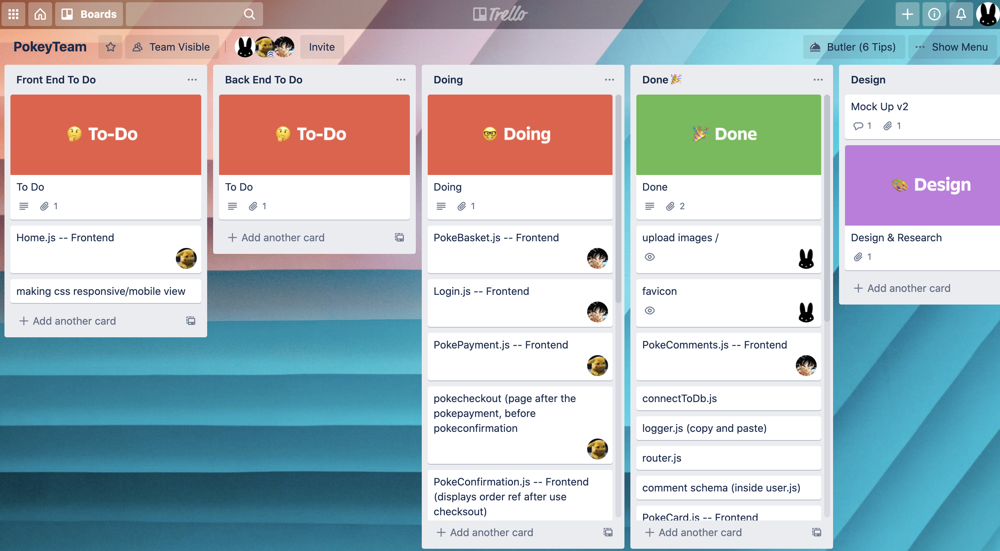
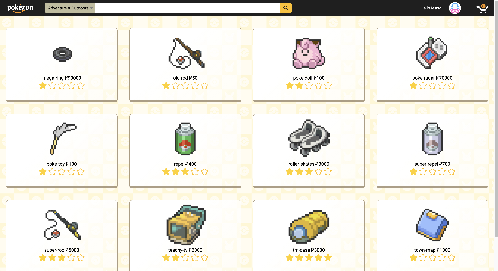
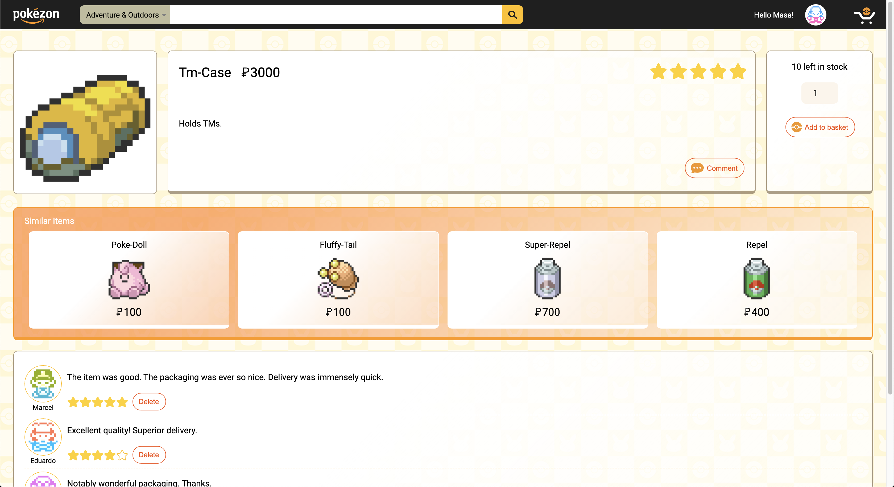
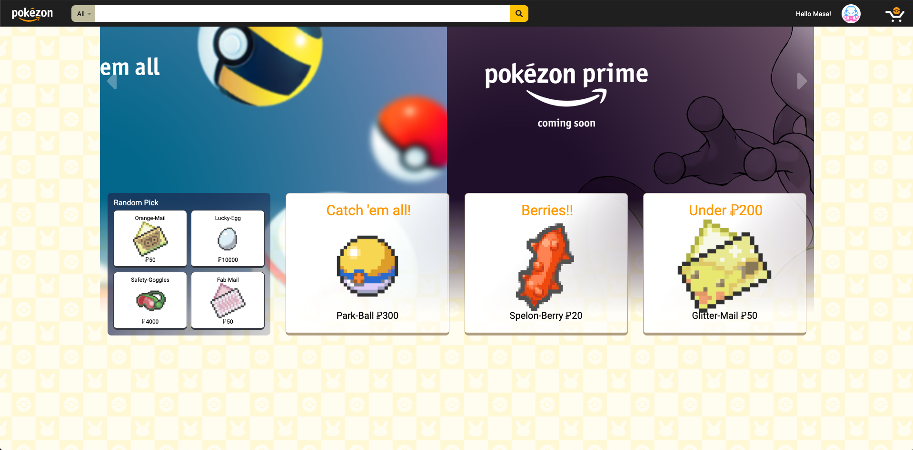
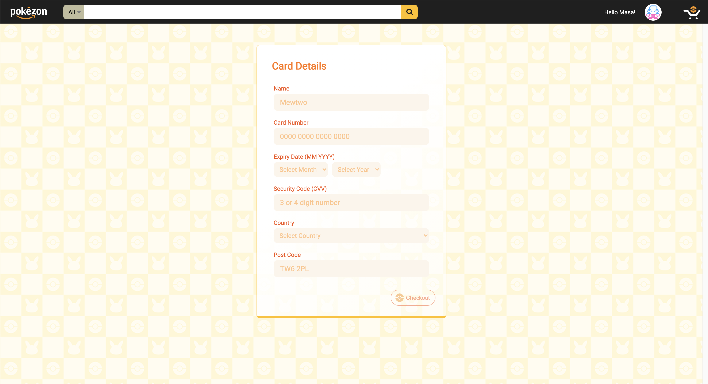
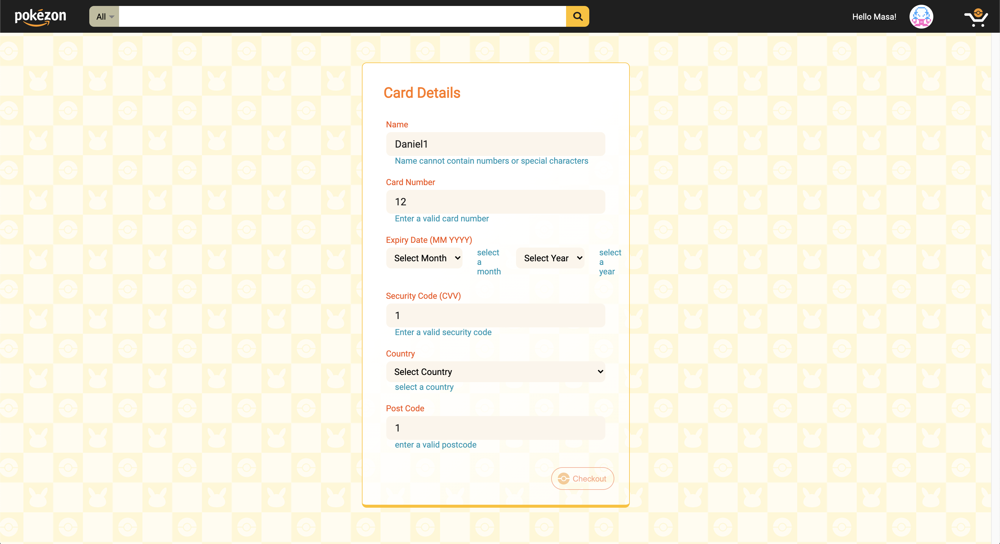

# sei project 3 - Pokézon

## Index
* [Overview](#overview)
* [Installation](#installation)
* [Technologies Used](#technologies-used)
* [Approach](#approach)
  * [Explanations](#explanations)
  * [Thoughts](#thoughts)
* [Conclusion](#conclusion)
	* [Wins and Challenges](#wins-and-challenges)
	* [Some Learnings](#some-learnings)


## Overview 

For my third project in General Assembly's Software Engineering course the task was to, in groups of 3 and in a timeframe of 9 days, develop a full-stack website, making our own back-end using a mongo database and express to handle the data and React for the front-end (using the MERN stack)

For this project we were given green light to choose what we wanted to build, in our case we went for an e-commerce website which after lots of thought and discussing with the team we chose to clone Amazon but Pokémon-themed.

This project was half-way into the course and was the biggest one in terms of time and work, a lot of work was put into it and its still being updated by all the members involved in order to improve some features and fix some details.


## Installation

First we need to download the repository into our own machine for which we have to input the following line into our terminal or command line:
```bash 
git clone https://github.com/DanielFDA/sei-project-3.git
```

then we need to make sure [mongoDB](https://www.mongodb.com/try/download/community) is installed and running, for which we run the following command 
```bash 
mongod --dbpath ~/data/db
```
then you'll need to install dependencies in the command line or terminal, making sure you're inside the root of the project. The address on the terminal should look something like this
```bash 
~/GA/development/PROJECTS/sei-project-3
``` 
to install back-end dependencies, in the root of the project (folder) run `yarn`

then to install front-end dependencies we'll have to change folder and install for which we run
```bash 
cd client && yarn
``` 
if it's our first time runnig the project on this computer we'll have to seed the database, to go back to the root of the project type `..` in the terminal or command line and make sure theres nothing after `sei-project-3`, then we run the following
```bash 
yarn seed
``` 
Now we are ready to run the project, for that we type the next line into the terminal or command line
```bash 
yarn dev-fullstack
``` 


## Technologies Used
* CSS
* JavaScript (ES6)
* HTML5
* Node
* Express
* MongoDB
* React
* Insomnia
* Trello
* Cloudinary
* GitHub
* Git
* Heroku
* Google Sheets
* VSCode

## Approach

For this project I had two teammates, [Masa](https://github.com/masarabbit) and [Christian](https://github.com/ChrisTheCyberCoder)

The first thing we did for this project after discussing and coming with the idea of cloning Amazon was to draw a mock up and talk about all the features that we thought were mandatory for the site to be deployed. The mock up looked like this (this was done by [Masa](https://github.com/masarabbit), in fact almost all the styling on this app was done by this genius of CSS and great friend)

<p align="center" width="100%">
     
</p>

First, like in Amazon we wanted the user to land in a home page with some items being displayed. We wanted to make it so the user could search and use the website without being logged in and only functionality like creating comments, rating items and adding items to the basket would be locked out if not logged in. Some other pages the user would just not be able to see if he wasn't logged in, and then after logging in you could do the before mentioned and also go to your basket and checkout, here you would have a form to input the card details and effectively buy the items (there's no real transactions).

Then due to the app having lots of features we had to split tasks in order to be able to achieve them, for this we used Trello in order to effectively communicate what each one of us was working on at the time. This was updated regularly and we would have standup sessions in the mornings to talk about the work done the previous day and what we would be working on for that day for this we used Zoom. We kept in a call for most of the day and communicated afterwards via Slack in case anyone need anything or to update each other.

<p align="center" width="100%">
     
</p>


### Explanations

Now going into the coding phase we had to set up the backend first in order to do anything in the front-end side of things. For this we all contributed in order to set it up and make the basic models needed for the project. Most of the back-end work was done by my teammate [Christian](https://github.com/ChrisTheCyberCoder), which he spent most of his time working on.

After that we had to work on the API that we were going to use to create the database, but lots of the data had to be edited so we basically had to do it from scratch grabbing the information in pieces. Most of this work was done by my teammate Masa and it's perfectly detailed in his [readme](https://github.com/masarabbit/sei_project_3/blob/main/README.md) for this project.

The objects used for the database would go on to look like this:

```js
export default [
  {
    name: 'master-ball',
    stock: 2,
    description: 'Catches a wild Pokémon every time.',
    price: 100000,
    category: 'pokeballs',
    image: 'https://res.cloudinary.com/dcwxp0m8g/image/upload/v1610396541/pokezon_db/master-ball.png'
  }, {
    name: 'ultra-ball',
    stock: 50,
    description: 'Tries to catch a wild Pokémon. Success rate is 2×.',
    price: 800,
    category: 'pokeballs',
    image: 'https://res.cloudinary.com/dcwxp0m8g/image/upload/v1610396559/pokezon_db/ultra-ball.png'
  }, {
    name: 'great-ball',
    stock: 45,
    description: 'Tries to catch a wild Pokémon. Success rate is 1.5×.',
    price: 600,
    category: 'pokeballs',
    image: 'https://res.cloudinary.com/dcwxp0m8g/image/upload/v1610396533/pokezon_db/great-ball.png'
  }, {

    //* ... rest abbreviated ... *//
    // snippet taken from Masa's readme
```

Most of my time coding on this project was focused on the logic for the pokePayment page and the base jsx for multiple pages like the home page, the index page and show page, checkout, confirmation (not deployed to the site) and the payment page itself. This was the basic formatting for how every page would look which would then be changed and styled as we needed.

This is how the JSX for the index page looked :

```js
<>
  {filteredItems.map(item => (
    <PokeCard key={item._id} {...item} />
  ))}
  <div className="pagination_wrapper">
    <div className="inner_wrapper">
      {
        Number(page) !== 1 &&
        <button onClick={prevPage}>
          
        Prev
        </button>
      }
      { 
        mapPageLinks(Math.ceil(filterItems(items).length / 12))
      }
      {
        Number(page) !== Math.ceil(filterItems(items).length / 12) &&
        <button onClick={nextPage}>   
          Next
          
        </button>
      }
    </div>
  </div> 
</>
```

And after all the styling and everything being set up correctly, it would look like this, the pagination was made by Masa

<p align="center" width="100%">
     
</p>

This page would display the items with their name, price and star rating based on the search criteria 

For the show page some of the jsx looked like this:

```js
<>
  <div className="product_wrapper">
    
    <div className="product_info">
      <div className="rating">
        {mapStars(itemRating(item.avgRating))}
      </div>
    
      <label>
        {item.name}
         {item.price}
      </label>
      <div className="description">{item.description}</div>
      <div className="button_wrapper comment">
        <Link to={`/pokecomment/${id}`}>
          <button>
             Comment
          </button>
        </Link>
      </div>
    </div>
    <form className={`buy_wrapper ${itemInBasket && 'accepted'}`} onSubmit={addToBasket}>
      {item.stock ?
        <p className={item.stock <= 2 && 'red_text'}> {item.stock <= 2 && 'only '}{item.stock} left in stock</p>
        :
        <p className="red_text">sorry, out of stock</p>
      }
      <input type="number" defaultValue={itemQty} name="qty" min="1" max={item.stock} onChange={(e)=>setItemQty(e.target.value)}/>

      { itemInBasket ? <p className="blue">Item added in basket!!</p> : null }
      { notLoggedIn ? <p className="blue">! Login to add to basket</p> : null}
      <div className="button_wrapper">
        <button>
           Add to basket
        </button>
      </div>  

    </form> 
    { itemAlreadyInBasket ? 
      <div>
        <p>! Item already in basket</p> 
        <button onClick={()=>setItemAlreadyInBasket(false)}>Ok</button>   {/* need styling here */}
      </div>
      : null }
  </div>
</>
```

And in the end this ended up looking similar to this:

<p align="center" width="100%">
     
</p>

This page was among the most worked pages on the site because it had to display multiple things and needed error handling and bug fixing for most of the features. This page had to show the item with its price and description, had to have the option to create a comment and the all the comments made on the item should be shown, with the option to delete the comment, the user would only be able to delete a comment if they are the user who created them and if they tried to delete a comment from another user the input would be ignored. Theres also a carrousel on this page that will show similar items based on the category of the item being shown.

The home page jsx would look something like this

```js
<>
  <div className="home_hero_wrapper">
    <div className="left_arrow"  onClick={prevHero}>
      
    </div>  
    <div className="inner_wrapper">
      <div className="hero" style = {{ left: `${heroPos}%` }}>
          
      </div>
      <div className="hero" style = {{ left: `${heroPos}%` }}>
          
      </div>
      <div className="hero" style = {{ left: `${heroPos}%` }}>
          
      </div>
      <div className="hero" style = {{ left: `${heroPos}%` }}>
          
      </div>
      <div className="hero" style = {{ left: `${heroPos}%` }}>
          
      </div>
    </div>
    <div className="right_arrow" onClick={nextHero}>
      
    </div> 
  </div>
  <div className="home_content_wrapper float_up_no_margin">
    <div className="home_section grey_background quarter">
      <label>Random Pick</label>
      {mapSmallBoxes(randomItems)}
    </div>  
    <div className="home_section single default_box_style quarter">
      <label>Catch &apos;em all!</label>
      {mapOneItem(randomPokeball)}
    </div>  
    <div className="home_section single default_box_style quarter">
      <label>Berries!!</label>
      {mapOneItem(randomBerry)}
    </div>  
    <div className="home_section single default_box_style quarter">
      <label className="cheap_item">Under 200</label>
      {mapOneItem(randomCheapItem)}
    </div>  
  </div> 
</>
```

For this page, the idea was to show 4 different divs filled with items based on different categories, one of them would have randomly selected items, another would display a random pokeball, another a random berrie and the last one would display a random item below a certain amount. This page was heavily worked and updated by Masa in order to make everything work correctly, and to display the carousel banner to show incoming features or selected banners.

It would then look like this

<p align="center" width="100%">
     
</p>

</br>


Some of the code that I did for this app revolved around the payment page which I will explain next.

First ill show how the form will look like in the end 

<p align="center" width="100%">
     
</p>

For this page the first thing that we needed was to get the logged in user data that we were going to later work with

```js
  React.useEffect(() => {
    const getData = async () => {
      try { 
        const { data } = await axios.get('/api/userprofile', headers())
        setUserProfileData(data)
      } catch (err) {
        console.log(err)
      }
    }
    getData()

  }, [1])

```

Then we needed a different state for each one of the form inputs to be able to make the customized error handling and create a formdata state that will store the values that are written into the form to save them and use them in other pages (if we had real transactions some of these values would be encrypted before being stored):

```js
  const [cardValid, setCardValid] = React.useState('')
  const [nameValid, setNameValid] = React.useState('')
  const [monthValid, setMonthValid] = React.useState('')
  const [yearValid, setYearValid] = React.useState('')
  const [codeValid, setCodeValid] = React.useState('')
  const [countryValid, setCountryValid] = React.useState('')
  const [postcodeValid, setPostcodeValid] = React.useState('')
  const [formdata, setFormdata] = React.useState({
    name: '',
    card: '',
    month: '',
    year: '',
    code: '',
    country: '',
    postcode: ''
  })
```

After that we created a regex to evaluate each one of the fields (will explain the functionality each regex)

```js
  const simpleRegex = new RegExp(/^\b(?!.*?\s{2})[A-Za-z ]{1,50}\b$/)
  const cardRegex = new RegExp(/^[0-9]{4}(?:[-\s]*[0-9]{4})(?:[-\s]*[0-9]{4})(?:[-\s]*[0-9]{4})$/) 
  const yearRegex = new RegExp(/^[0-9]{4}$/)
  const codeRegex = new RegExp(/^[0-9]{3,4}$/)
  const postcodeRegexSimplified = new RegExp(/^[A-Za-z0-9]{2,10}(?:[-\s]*[A-Za-z0-9]{2,10})/)
```

The simpleRegex objective was to make sure that the field in which it was used had to be made out of only letters and would allow 1 space in between words, the maximum characters for this field would be 50.

The card Regex would make sure that the input had to have a total of 16 digits not more or less and could have spaces or dashes in between every 4 digits.

The year regex would make sure that the year was made of 4 digits 

The code regex was to make sure the security code or CVV had to be made out of 3 or 4 digits.

The postcode regex simplified was the second version of this regex, the first one evaluated to only accept valid UK postcodes but then we changed it so it was more permisive with other formats, what is does in this version is make sure the first part of the post code consists of at least 2 characters (either numbers or letters) and followed by a minimum of other 2 characters, up until 10 in both cases, you can have dashes or spaces in between both parts of the postcode.

Now to use these regexes I made two functions. The first one 

```js
  function setStates(nombre, bool) {
    switch (nombre) {
      case 'card':
        setCardValid(bool)
        break
      case 'name':
        setNameValid(bool)
        break
      case 'month':
        setMonthValid(bool)
        break
      case 'year':
        setYearValid(bool)
        break
      case 'code':
        setCodeValid(bool)
        break
      case 'country':
        setCountryValid(bool)
        break
      case 'postcode':
        setPostcodeValid(bool)
        break
    }
  }
```

was designed to take two props, a name and a boolean. It was tasked with grabbing whatever was passed as nombre (name) and checking which case it matched in order to change the correct state.

It worked in conjunction with this other function 

```js
  const handleValidation = (event) => {
    event.preventDefault()
    let regex = null
    let nombre = ''
    switch (event.target.name) {
      case 'card':
        regex = cardRegex
        nombre = 'card'
        break
      case 'name':
        regex = simpleRegex
        nombre = 'name'
        break
      case 'month':
        regex = simpleRegex
        nombre = 'month'
        break
      case 'year':
        regex = yearRegex
        nombre = 'year'
        break
      case 'code':
        regex = codeRegex
        nombre = 'code'
        break
      case 'country':
        regex = simpleRegex
        nombre = 'country'
        break
      case 'postcode':
        regex = postcodeRegexSimplified
        nombre = 'postcode'
        break
    }
    if (regex.test(event.target.value)) {
      const formData = { ...formdata, [event.target.name]: event.target.value }
      setFormdata(formData)
      setStates(nombre, true)
      return
    }
    setStates(nombre, false)
    
    if ((event.target.name === 'card' || event.target.name === 'postcode' || event.target.name === 'code') && event.target.value === '') {
      setStates(nombre, true)
    }
  }
```

What this function did was use the event to locate what field was being inputted and assign the right regex for it, it will then run the test to see if the field in line and if it was it would set the inputted values to the formstate in order to store them and update the correct state using the setStates function and passing it the name with the true' boolean. In case it didn't pass the regex test it would just update the setStates function to set the right state to false'. The conditional flow was made for specific cases where if the user wrote something and then erased it the error would persist on the screen until he fixed it, I didn't want this to happen unless the user inputted a wrong value so had to make this.

This is how the form would look if there's any errors while inputting the data

<p align="center" width="100%">
     
</p>

All the errors would be evaluated as the user inputted them in order to show everything smoothly and to avoid the user submitting the form without having valid values

### Thoughts

This was a really huge and complicated project, but that only made it so we all learned tons, because at this point of the course we were all pretty comfortable researching and learning as we went so we could implement what we wanted for all the features, even with this we couldn't finish all the features that we set out to do because of not having enough time, so we had to keep some of them hidden from the deployed site.

I think everyone on team agrees that this project was a huge win and learning for us, and the fact that it ran smoothly and with very few bugs/core features missing was terrific for me

Have to say that I enjoyed a lot working with both Masa and Christian on this project they both had a lot of insight and inspired me to work harder and better in order to make this site the best we could.

## Conclusion

### Wins and Challenges

The biggest win for me was learning how to work as a team, not only communicating efficiently, being on the same page and sharing a common goal but also learning to use git commands and getting more used to sharing thoughts about ongoing work and to-be added features.

The biggest challenges I encountered were mainly code related, stuff that I wanted to implement but had to research and try to do it and sometimes having to ask for help because time was of the essence, which helped me learn a lot of new stuff and kept us as a cohesive team. 


### Some Learnings

This being the biggest project I worked on during the course meant that it's the one where I learned the most about the front-end side of things which is where I spent the majority of my time.

Being up to date with our daily standups and meeting played a big role in order for me to be aware of how things were working in the back-end side of things (in case they changed from one day to another) and made everything go smoother coding wise, also teached me a lot about how and what to communicate in order for the best approach to be taken about a certain matter.

Since this was my first time working on a full-stack app the beggining was very tough, having to set up everything and being able to run it in all of our computers and update with regular commits so we could see the improvements of everyone involved was a huge learning process that was well worth it in the end because we all felt very comfortable using git at the end of it.

All the process that took part in this project was very unique and special, we were very ambitious with the amount of functionality we wanted for the website but at the same time everyone was working very hard to achieve everything that we set up to do, due to the amount of work some of the features weren't completely polished and had to be left out of the deployed website but I feel like my teammates and I are very happy about the outcome of this project and I'm certainly very grateful of being part of it, it was a tiring but very enjoyable experience.


[Index](#index)